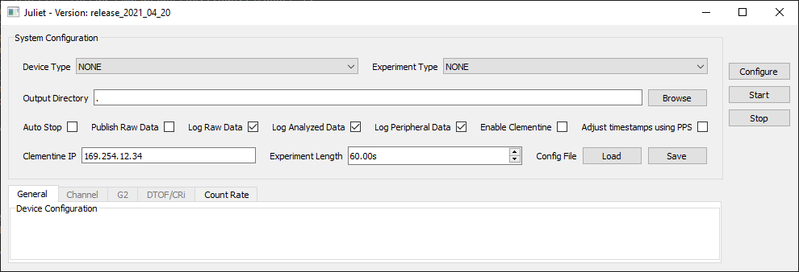
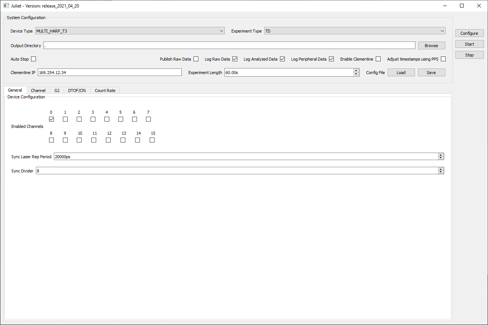
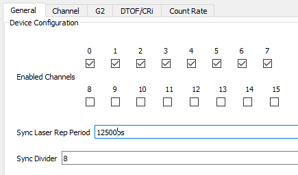
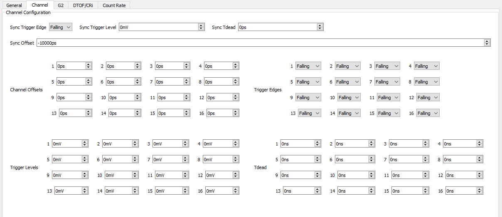
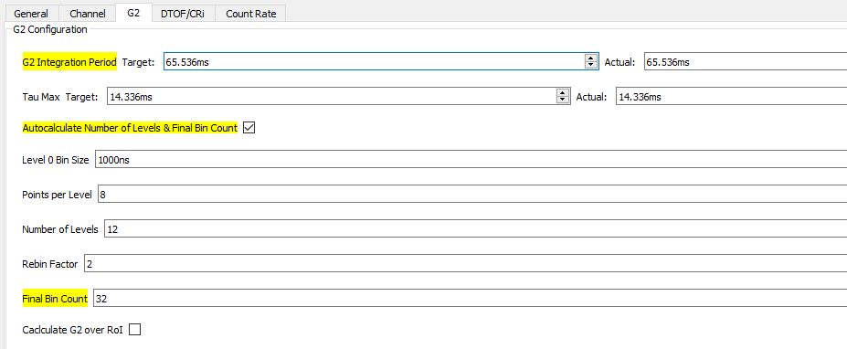
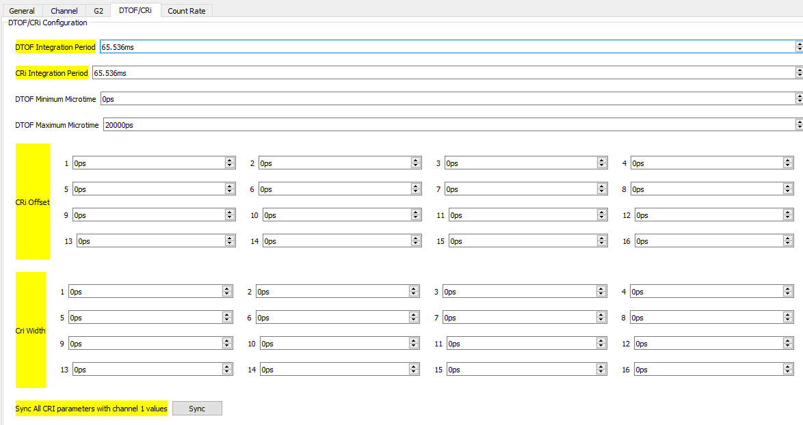
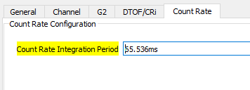

.. cpp:namespace:: pnd::pando

==========
Getting Started with Pando
==========
Pando makes it easy to run experiments with and collect data from several different time tagger and SPAD devices.

This guide will take you step-by-step through running experiments with real devices.

Prerequisites
-------------
Pando runs on Windows and is built as Python pex executable. It requires Python 3 to be installed on the Windows PC.

You must install the drivers for the devices you will be working with.

You must install the latest Microsoft Visual C++ Redistributable for Visual Studio from `here <https://support.microsoft.com/en-us/topic/the-latest-supported-visual-c-downloads-2647da03-1eea-4433-9aff-95f26a218cc0>`_.

Starting Pando
---------------
Open a command prompt (cmd.exe) and navigate to the directory where the pando.pex file is located.

At the prompt, run the command ``python pando.pex``.

The Pando GUI will open: 

   
   Screenshot of the Pando GUI

Selecting a Device and Experiment Type
--------------------------------------
The device and experiment types chosen will determine the what options and defaults are available in some parts of the GUI. For this tutorial, we will be running a TD experiment with PicoQuamt's MultiHarp device.

Once you have set the the device and experiment types, the GUI will update to accommodate devices-specific settings.

   
   Pando GUI with Device Type "MULTI_HARP_T3" and Experiment Type "TD" selected

Channel Selection and General Device Configuration
--------------------------------------------------
On the "General" tab in the device configuration section, select the channels to be used by checking the corresponding checkboxes in the "Enabled Channels" area. Data from unselected channels will be ignored. Set an appropriate Sync Divider value, and also the correct Sync Laser Rep Period -- the time in picoseconds between two consecutive sync pulses.

   Enabled Channels, Sync Laser Rep Period and Sync Divider settings in the "General" tab

Input Channel Configuration
---------------------------
Next, configure the settins per input channel. The settings available on "Channel" ta vary significantly depending on the device type selected. For the MultiHarp device, make sure the Channel Offsets, Trigger Edges, Trigger Levels and programmable dead times are correct for each channel.

   Input Channel Configuration for MultiHarp on "Channel" Tab

G2, DToF and CRi
----------------
The last three tabs in the Device Configuration Panel allow you to set parameters for their respective calculations.

   G2 Configuration Parameters

   DToF Configuration Parameters

   Count Rate Configuration Parameters

