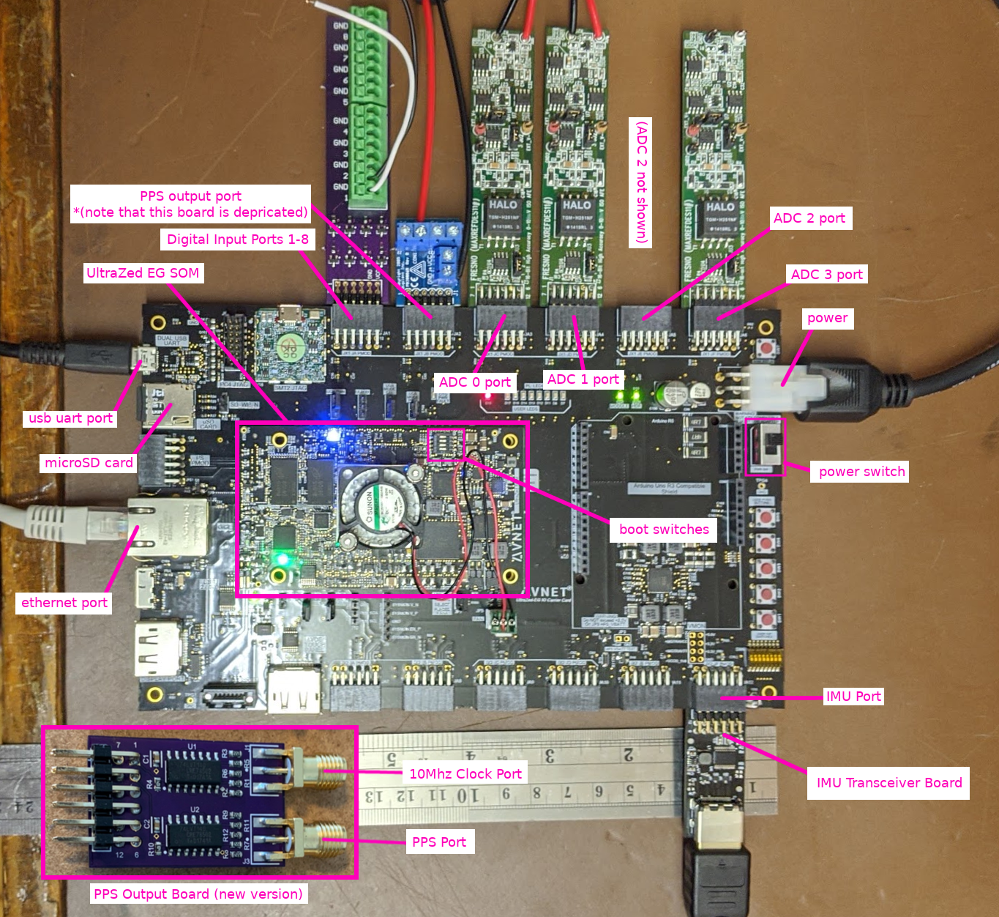
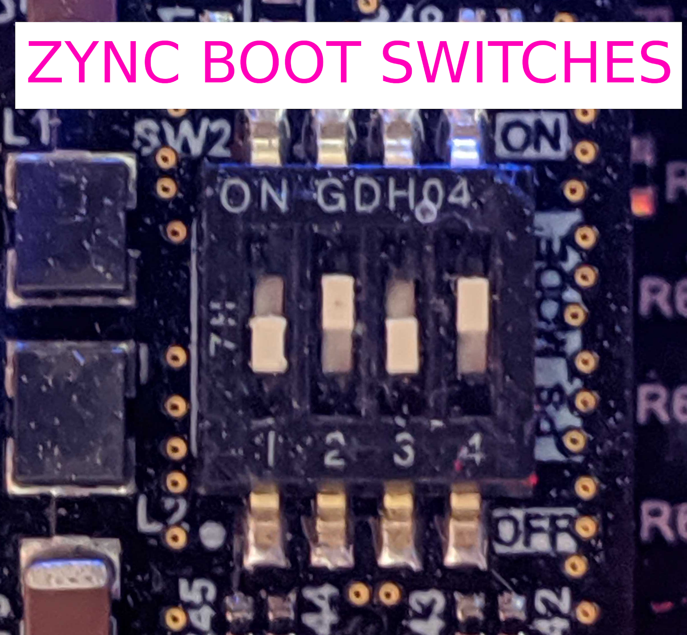
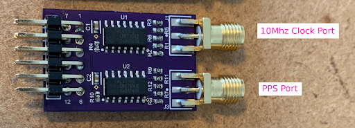
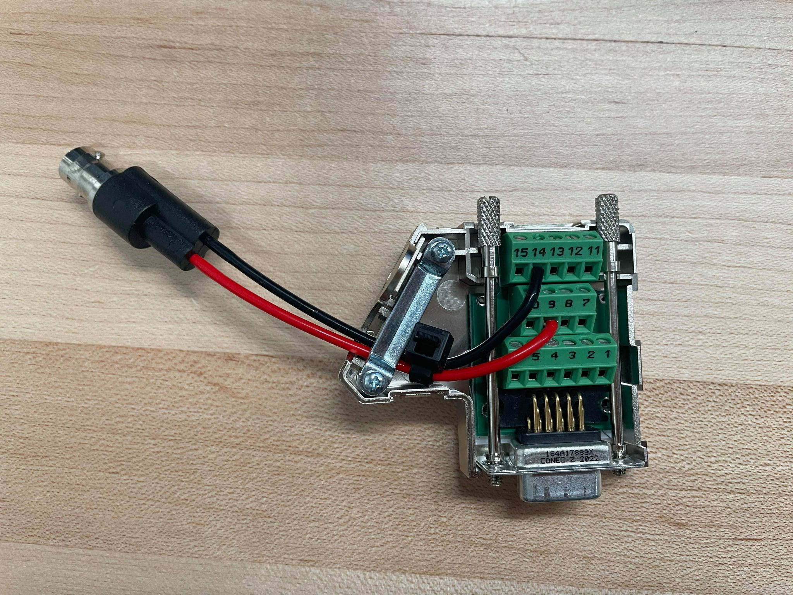
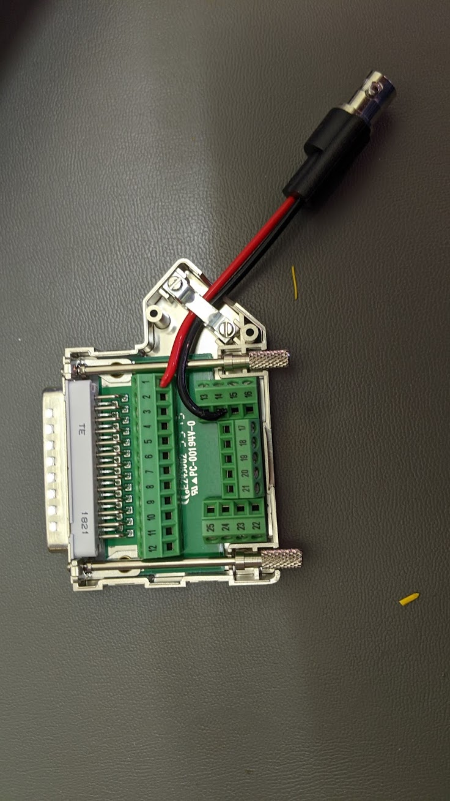

.. cpp:namespace:: pnd::pando

==========
Getting Started with the Sync Box
==========

Ultrazed Setup
--------------
Below is an overview image of the internals of the Sawyer Sync Box, which consists of the UltraZed-EG with IO Carrier card and peripheral interface boards.  Relevant components are labelled.

PMOD Boards
^^^^^^^^^^^
There are 7 PMOD devices that must connect to specific ports on the Ultrazed:

1. The IMU transceiver board, which interfaces with the IMU over an HDMI cable. Plug into the JX2 JF PMOD port on the carrier card.
2. The digital input interface board, which breaks out the 8 digital input channels. Plug into JX1 JA PMOD port.
3. PPS output breakout board, which breaks out the PPS signal to be plugged into the timetagger device. Plug into JX1 JB PMOD port.
4. ADC 0, which receives analog input. Plug into JX1 JC PMOD port.
5. ADC 1, which receives analog input. Plug into JX1 JD PMOD port.
6. ADC 2, which receives analog input. Plug into JX1 JE PMOD port.
7. ADC 3, which receives analog input. Plug into JX1 JF PMOD port.

Boot Switches
^^^^^^^^^^^^^
In order to make the board boot from SD card, the boot switches on the UltraZed board must be set appropriately (location of the switches is indicated in the above overview image). The switch settings are: 1: OFF/down, 2: ON/up, 3: OFF/down, 4: ON/up.

SD Card
^^^^^^^
A microSD card will be provided by LeafLabs that is used to boot the board. The most-up-to-date image for the board plus the current build of Pandoboxd (the board-side data acquisition application) will also be provided. If updated software is required, LeafLabs will provide new images and/or Pandoboxd executables. The SD card is FAT format and should not be reformatted. The boot files must be copied onto the SD card and any old files removed. The required files are image.ub, BOOT.bin, and pandoboxd (a linux executable). Please note that the pandoboxd executable must be named “pandoboxd” exactly, or the executable will not be run automatically after booting.

Networking
^^^^^^^^^^
By default, the UltraZed board is configured to use a fixed ipv4 link-local address: 169.254.12.34.  The preferred method to connect is to directly connect an ethernet cable to a  NIC attached to the target control PC.

If using Linux, you may need to configure your network interface to use link-local IPV4 addressing.

* Open the network management dialog, select your ethernet adapter, and press configure (location varies by distribution)
* On the IPV4 tab, change "method" to "Link-Local Only"

  * .. figure:: img/linux_networking.png

* You should be able to see a link-local address via "ifconfig"
  
  * .. figure:: img/ifconfig.png
  * (Note the inet prefix 160.254)

On most recent versions of windows, acquiring a link-local address should be automatic, however it may be necessary to execute the command ipconfig /renew in a command prompt in order for the changes to take effect.

Power
^^^^^
The provided UltraZed power cable should be inserted into the board. The master power switch is located next to the power socket.

USB UART Terminal
^^^^^^^^^^^^^^^^^
(note: this section is not important for setup; the UART interface will not need to be used under normal circumstances. This information is provided for future reference only)

If a terminal interface to the UltraZed is ever required, there is a microUSB port labeled “Dual USB UART” on the board which can be used to establish a connection between the board and a PC. The terminal can be used via a terminal program such as screen or teraterm at a baud rate of 115200. See here for additional details. The default credentials for the board are username: root, password: root.

Connecting to Peripherals and Timetagger Devices
------------------------------------------------

Digital Inputs
^^^^^^^^^^^^^^
Digital signals must be input into one of the eight broken-out channels on the Digital Input PMOD interface board. These signals must be properly driven digital signals, between 3.3V and 5V. Ensure that each signal is grounded to one of the eight ground connectors.

ADCs
^^^^
Each ADC board accepts one analog signal. Signals must be between 0V and 10V. Some of the ADCs have a BNC female connector, while others have loops for clips or probes. Note that the input of the ADC is isolated from the board-side, so the input signals should not be grounded to the board.

IMU
^^^
The IMU board is connected to the IMU transceiver via an HDMI-to-microHDMI cable. The cable should not be in excess of 25 feet.

PPS Output
^^^^^^^^^^
The sync box generates a 1Hz PPS signal that must be connected to the desired timetagger device in order to synchronize experiments with the sync box peripherals. The PPS breakout board attached to the UltraZed outputs the PPS signal via a BNC female connector. This Timetagger-device-side connector is slightly different for each device:

HydraHarp
"""""""""
The PPS signal should be attached to Marker Channel 1 on the Hydra Harp. The marker channels have NIM-CAMAC female connectors. A NIM male - SMA male cable is needed to interface the PPS signal with the marker channel port.

PicoHarp
""""""""
The PicoHarp’s marker channels are accessed via the RT port. A mate for this port with marker channel 0 broken out to BNC female is shown in the illustration below. A BNC male - SMA male cable is needed to interface the PPS signal with the port.

The connector for the RT port is a 15-pin DSUB male connector. The pinout of the provided adaptor is shown in the image below if additional units are needed.

MultiHarp
"""""""""
The MultiHarp’s marker channels are accessed via the CTRL port. A mate for this port with marker channel 1 broken out to BNC female is shown in the illustration below. A BNC male - SMA male cable is needed to interface the PPS signal with the port.

The connector for the CTRL port is a 25-pin DSUB. The pinout of the provided adaptor is shown in the image below if additional units are needed.

PF32
""""
The PPS signal should be attached to the PF32’s “PIXEL” input. An SMA male - SMA male cable is needed to interface the PPS signal with the port.

Running an Experiment
---------------------
1. Ensure that the board is set up as described in the above section. Ensure that the network is properly configured. Ensure that the SD card with current image and pandoboxd executable is inserted.
2. Attach all desired peripherals to their corresponding PMOD peripheral interface.
3. Attach PPS signal to the desired timetagger device.
4. Connect timetagger device to host PC.
5. Power on sync box and timetagger device.
6. Run pando on host PC. Configure Pando to use PPS, use Pandoboxd, and enter the correct IP address of Pandoboxd (found in the network section above).
7. Start the experiment with desired parameters.

To run a sync box experiment without a TImetagger device, select Device Type: NONE and Experiment Type: NONE while configuring pando.

